# 🚖 NYC Taxi Performance Analytics

Ce dépôt contient un projet décisionnel complet simule l'ingénierie et l'analyse de données sur l'activité des célèbres taxis jaunes de New York (TLC). 
L'objectif est de structurer un pipeline robuste 
capable de transformer de gros volumes de données brutes 
stockés en base relationnelle en insights business actionnables au travers d'un Dashboard interactif et automatisé.

---

## 🏗️ Architecture Technique & Workflow (Pipeline)

L'architecture du projet applique les meilleures pratiques de développement et d'automatisation (**DataOps**) au sein d'un environnement unifié :

[PostgreSQL] ──(Extraction Dynamique SQL)──> [Dataiku DSS] ──(Recipe Prepare)──> [Metrics & Checks] ──> [Dashboard]

1. **Extraction (PostgreSQL) :** Gestion de plus de 3 millions de lignes. Afin d'assurer un développement agile et d'optimiser les ressources de calcul, une logique d'échantillonnage dynamique (`${limite_lignes}`) a été mise en œuvre.
2. **Feature Engineering (Dataiku DSS) :** Nettoyage des valeurs aberrantes (trajets trop longs, montants incohérents) et calculs de KPI métiers (Vitesse Moyenne, Taux de Pourboires).
3. **Qualité de Données (Data Quality) :** Intégration de règles de validation automatiques (`Checks`) sur les indicateurs de volume et de cohérence des montants.
4. **Restitution (Analytics Dashboard) :** Dashboard interactif en 3 volets distincts (Performance financière, Efficacité opérationnelle, Comportement des passagers).

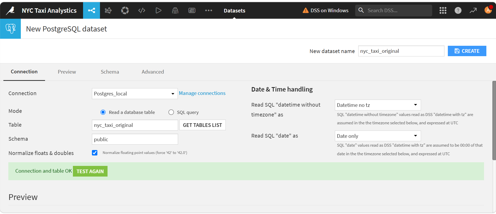
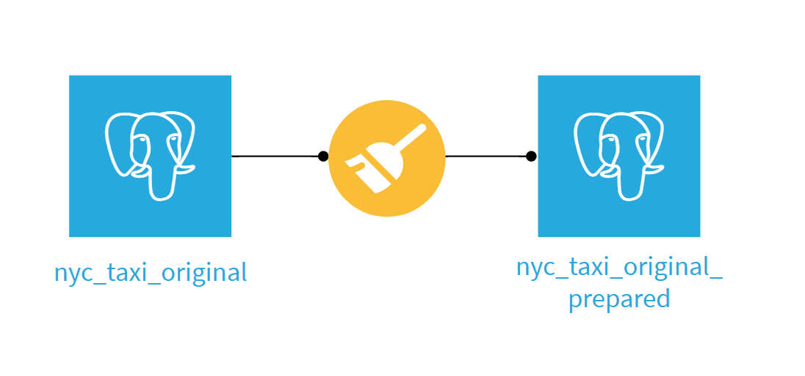

---

## 🔄 Automatisation & DataOps (Le Scénario Maître)

Pour rendre ce projet **Production-Ready**, un scénario d'automatisation complet est configuré pour s'exécuter de façon autonome :

* **Étape 1 : Changement de Variable (`Set project variables`)** ➡️ Le scénario bascule dynamiquement la variable `${limite_lignes}` vers un volume de production (ex: 300 000 lignes ou plus).
* **Étape 2 : Reconstruction forcée (`Build`)** ➡️ Dataiku interroge PostgreSQL avec la nouvelle limite et recalcule de façon robuste l'ensemble des recettes.
* **Étape 3 : Contrôle Qualité (`Compute metrics`)** ➡️ Exécution de notre règle de qualité `Record count > 1` pour lever une alerte de sécurité avant la livraison des chiffres.

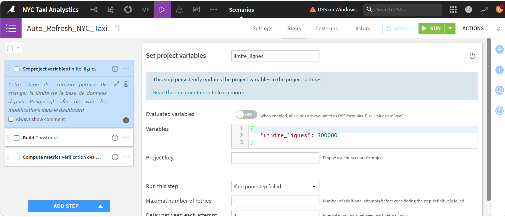
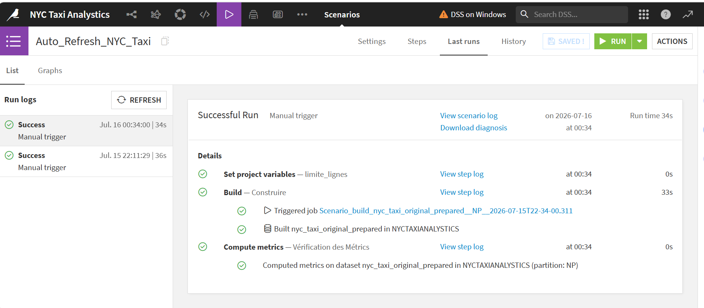

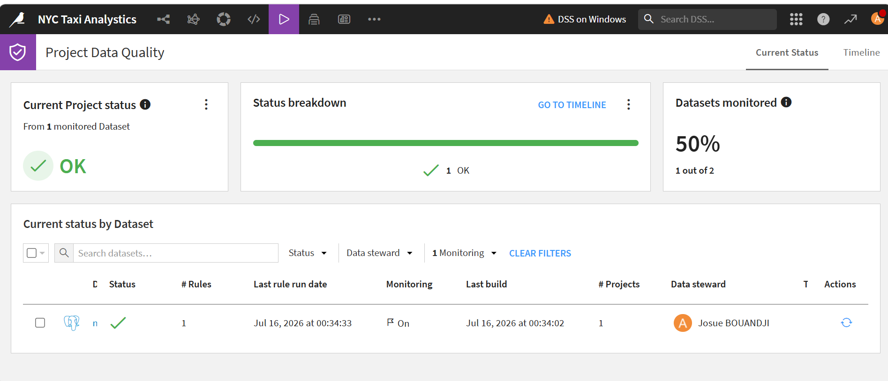

---

## 📊 Business Insights (Dashboard 3 Pages)

Le dashboard interactif final fournit des indicateurs clés d'aide à la décision :

### 💳 1. Performance Financière
* **Volume d’Affaires analysé :** $7,88 Millions de dollars générés par l'échantillon.
* **Régression Linéaire :** Modélisation de l'évolution des pourboires selon le prix de base de la course ($y = 2.7x + 8.36$). 
* **Optimisation :** Identification d'une opportunité business majeure sur les transferts aéroportuaires ($40.42k$ de frais aéroport).

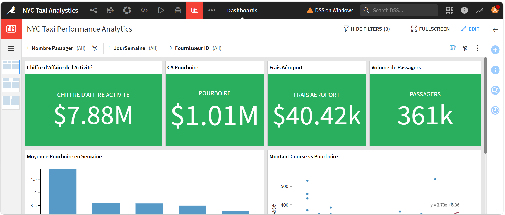
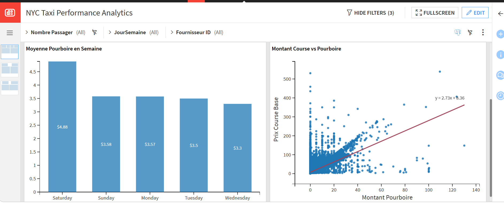

### 🚦 2. Efficacité Opérationnelle
* **Saturation Routière :** Analyse de l'impact de la congestion urbaine mettant en évidence une vitesse de circulation moyenne bloquée à **12 mph** (environ 18,7 km/h) sur l'ensemble de la ville.
* **Heures de pointe :** Graphique temporel montrant l'effondrement de moitié de la vitesse moyenne de jour face aux trajets de nuit.

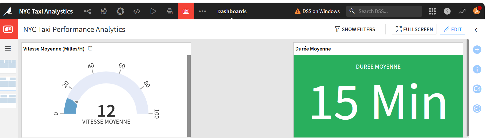
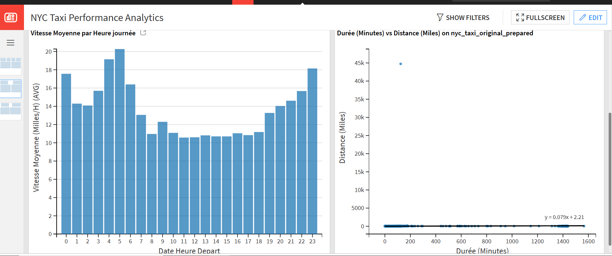

### 👥 3. Passagers & Moyens de Paiement
* **Habitudes de paiement :** Preuve d'une dématérialisation quasi-totale des règlements avec une écrasante majorité pour la **Carte bancaire (86.02 %)** par rapport aux Espèces (12.41 %).
* **Impact Marketing :** L'usage massif des terminaux électroniques porte le taux moyen des pourboires à un niveau exceptionnel de **22.27 %** grâce aux suggestions de dons automatiques.

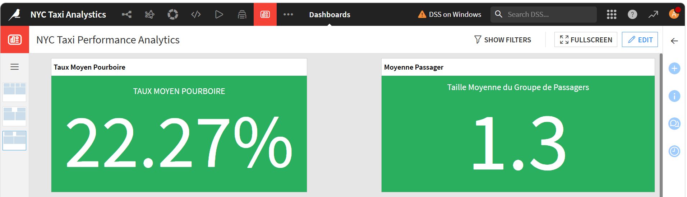

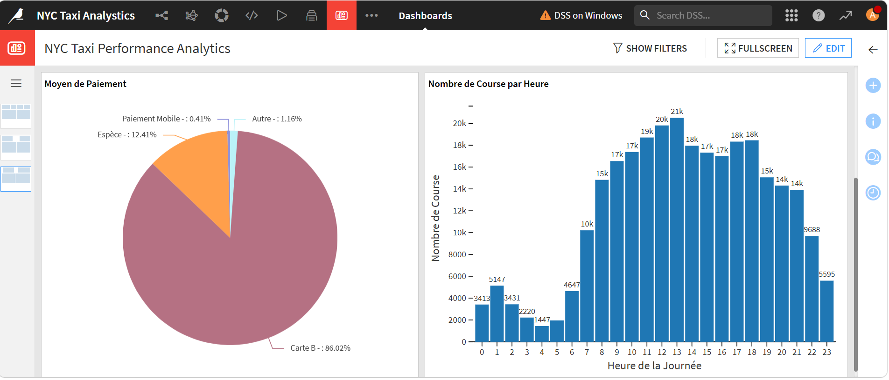

---

## 🛠️ Stack Technique & Compétences Clés
* **Outil ETL & Orchestration :** Dataiku DSS (Recipes, Variables globales, Scénarios, Metrics, Data Quality Rules)
* **Base de Données :** PostgreSQL (Requêtes d'extraction optimisées, indexation)
* **Visualisation :** Dataiku Dashboards (KPI Cards, Scatterplots, Donut Charts, Histograms)
* **Concepts Clés :** DataOps, Data Quality, Storytelling, Échantillonnage Dynamique.

---
